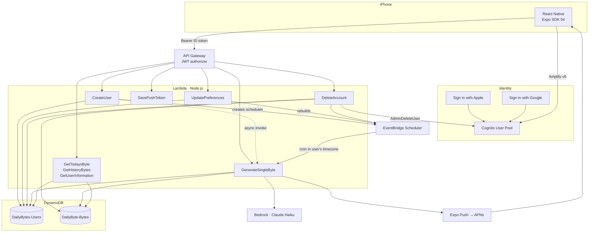

<div align="center">


# DailyByte

**One thing a day, worth knowing.**

Pick a topic. Choose when you want to hear from it. Every day, a short piece of knowledge arrives as a push notification — written for you, building on what you already learned.

No feed. No streak. Nothing to catch up on.

<br>


</div>

---

## The idea

Most learning apps compete for your attention. They build feeds, streaks and daily goals, and those create obligation — which turns into guilt, which turns into a deleted app.

DailyByte inverts that. The value arrives **before** you open anything. The notification isn't a prompt to come and use the product; the notification **is** the product. Everything else is optional.

A byte is a title, two or three sentences, and a link to read further. Small enough to finish while the kettle boils, specific enough to be worth knowing.

<div align="center">
<br>

<br>
<em>The whole app, most days.</em>
</div>

---

## Highlights

- **Fully serverless** — no servers, no containers, no always-on process. Every piece of compute is a Lambda invoked by an HTTP request or a scheduler.
- **Per-user scheduling** — each user gets their own EventBridge schedules in their own timezone, so delivery times mean what the user thinks they mean, DST included.
- **AI-generated, topic-constrained content** — Claude Haiku via Amazon Bedrock, with per-topic prompt guidance and explicit safety boundaries for all ten subjects.
- **Progressive learning** — the generator receives the reader's recent titles, so a subject accumulates instead of looping.
- **Three sign-in methods** — email/password, Sign in with Apple, and Sign in with Google, all converging on one onboarding path.
- **Push delivery end to end** — Lambda → Expo Push Service → APNs → device.
- **Complete account lifecycle** — including permanent deletion across four independent systems.
- **Designed, not templated** — a custom mascot, a cream-and-brown palette, Newsreader and Inter, and hand-built motion primitives.

---

## Architecture



Two entry paths reach the same compute layer. **Synchronous** requests arrive from the app through API Gateway, where a JWT authorizer validates the token before Lambda runs. **Asynchronous** invocations come from EventBridge Scheduler with a JSON payload and no HTTP at all. `GenerateSingleByte` serves both, resolving its user from either verified JWT claims or the scheduler payload.

---

## Tech stack

### Frontend

| | |
|---|---|
| **React Native 0.81** | New Architecture enabled |
| **Expo SDK 54** | Native modules, build tooling, EAS integration |
| **React 19** | Hooks and Context throughout |
| **AWS Amplify v6** | Cognito client, OAuth redirect handling, token lifecycle |
| **expo-notifications** | Permissions, push tokens, foreground handling |
| **expo-localization** | Device IANA timezone |
| **react-native-svg** | Logo and vector assets |

Navigation is hand-built — a three-tab app and a linear onboarding flow don't need a router. Styling uses React Native `StyleSheet` with a shared token file in `style/theme.js`.

### Backend

| | |
|---|---|
| **AWS Lambda** | Node.js ES modules, nine single-responsibility functions |
| **API Gateway** | HTTP API with a Cognito JWT authorizer |
| **DynamoDB** | Two tables, key-based access patterns only |
| **Cognito** | Email/password, Apple and Google federation |
| **EventBridge Scheduler** | Per-user, timezone-aware cron |
| **Bedrock** | Claude Haiku 4.5 via the Converse API |
| **AWS SDK v3** | Modular clients |

### Delivery

**EAS Build + Submit** → **TestFlight** → **App Store**. Signing credentials and the APNs key are managed by EAS.

---

## How it works

### Onboarding

```
Sign in (email · Apple · Google)
    → GET /user/information
        → 200  profile exists, open the app
        → 404  no profile yet
            → Topic → Schedule → Notifications
                → POST /user/create
                    ├─ write user row (conditional)
                    ├─ create N EventBridge schedules
                    └─ async invoke GenerateSingleByte
```

Every sign-in method lands on the same endpoint. Profile creation is an ordinary authenticated API call, which makes it idempotent and retryable — a user who abandons setup halfway is routed straight back in on their next launch.

### Delivery

```
EventBridge fires at the user's local time
    → GenerateSingleByte { userId, notify: true }
        ├─ read topic and push token from DynamoDB
        ├─ query the last 30 byte titles for that topic
        ├─ Bedrock Converse — topic guidance + reading history
        ├─ write the byte
        └─ Expo Push → APNs → device
```

### Deletion

```
DELETE /user/delete
    1. EventBridge schedules   ← first, so nothing generates mid-deletion
    2. All bytes               ← paginated query, chunked batch write, retry on unprocessed
    3. The user row
    4. The Cognito account     ← last, so any failure above stays retryable
```

---

## Backend reference

### Functions

| Function | Trigger | Responsibility |
|---|---|---|
| `CreateUser` | `POST /user/create` | Profile, schedules and first byte — the single onboarding endpoint |
| `GenerateSingleByte` | EventBridge · `POST /bytes/generate` · async invoke | Bedrock call, byte write, push send |
| `GetTodaysByte` | `GET /bytes/today` | The most recent byte |
| `GetHistoryBytes` | `GET /bytes/history` | Past bytes |
| `GetUserInformation` | `GET /user/information` | Preferences, or 404 when no profile exists |
| `UpdatePreferences` | `PATCH /user/preferences` | Topic, frequency and times; rebuilds schedules |
| `SavePushToken` | `PATCH /user/savetoken` | Device token sync |
| `DeleteAccount` | `DELETE /user/delete` | Full erasure across four systems |

### Data model

**`DailyBytes-Users`** — PK `userId`

```
userId · email · topic · bytesPerDay
deliveryTime [{hour, minute}] · timeZone
pushToken · active · createdAt
```

**`DailyByte-Bytes`** — PK `userId`, SK `date`

```
userId · date ("2026-09-22#143052")
topic · title · body · sourceURL
```

The sort key is a composite timestamp, so "this user's bytes, newest first" is one `Query` with `ScanIndexForward: false` — no index, no scan, no filter.

---

## Engineering notes

A few decisions worth explaining.

**Per-user schedules instead of a batch job.** The first design was one Lambda running hourly, scanning every user, computing local times and deciding who was due. It needed timezone arithmetic, a `revealAt` field, batching and DST handling. Replacing it with one EventBridge schedule per user per slot deleted all of it — `ScheduleExpressionTimezone` handles local time and DST natively, and the cron expression is simply the time the user picked.

**Push tokens are read at send time, never stored in the schedule.** EventBridge freezes a schedule's target payload at creation. Tokens change when a user reinstalls, so an embedded token would quietly send notifications nowhere. The token is fetched from DynamoDB at the moment of delivery instead.

**The model returns a search phrase, not a URL.** Asking for a source URL produced confident, plausible, dead links. The model now returns a `sourceQuery`, and the Lambda builds the URL with `encodeURIComponent`. The model does what it's good at — naming the concept — and the deterministic part stays deterministic.

**Idempotency lives in the database.** Profile creation writes with `ConditionExpression: attribute_not_exists(userId)`. Two racing requests can't both win; the loser gets a clean "already exists" rather than an error, and only the winner does the follow-up work. No application-level locking.

**Deletion is ordered by recoverability.** Cognito goes last. If the account were deleted first and a later step failed, the user would be locked out with orphaned data and no way to retry. Deleting it last means any failure leaves them able to press the button again.

**Schedule sync is delete-then-create.** When preferences change, all three possible slots are deleted unconditionally, then however many the user now wants are created. It's idempotent regardless of prior state, and it cannot leave an orphaned schedule firing forever.

**Per-topic prompt guidance.** Each of the ten subjects carries its own constraints — what to favour, what to avoid, and explicit safety boundaries. Telling the model that Etymology means *one word per byte* and History means *one specific event, not an era* improved output quality more than any other single change.

---

## Project structure

```
.
├── App.js                    Root component · auth and profile routing · push token sync
├── amplifyConfig.js          Cognito and OAuth configuration
├── api/
│   └── bytes.js              Fetch wrappers for every endpoint
├── context/
│   └── AuthContext.js        Auth state · sign-in methods · OAuth Hub listener
├── screens/
│   ├── Home.js               Today's byte
│   ├── History.js            Everything before it
│   ├── Settings.js           Preferences · sign out · delete account
│   ├── SignIn.js
│   ├── ResetPassword.js
│   └── Onboarding/           Welcome · Topic · Schedule · Notifications · SignUp
├── components/               ByteCard · NavBar · Mascot · Motion · provider logos
├── style/                    Per-screen stylesheets and theme tokens
├── assets/                   Daisy mascot poses · logos · imagery
├── docs/                     Privacy policy and support pages
└── Lambdas/                  Backend source, mirrored from AWS
```

---

## Running locally

```bash
npm install
npx expo start --dev-client
```

A development build is required rather than Expo Go, because the project uses native modules for authentication and push notifications.

```bash
eas build --platform ios --profile development
```

---

## Topics

Personal Finance · Psychology · Space & Astronomy · World History · Nutrition Science · Cooking & Food Science · Philosophy · Etymology & Word Origins · Sleep & Energy · Geopolitics

---

<div align="center">

Designed and built by **Arshia Adamian**

<sub>Daisy is a real dog.</sub>

</div>
